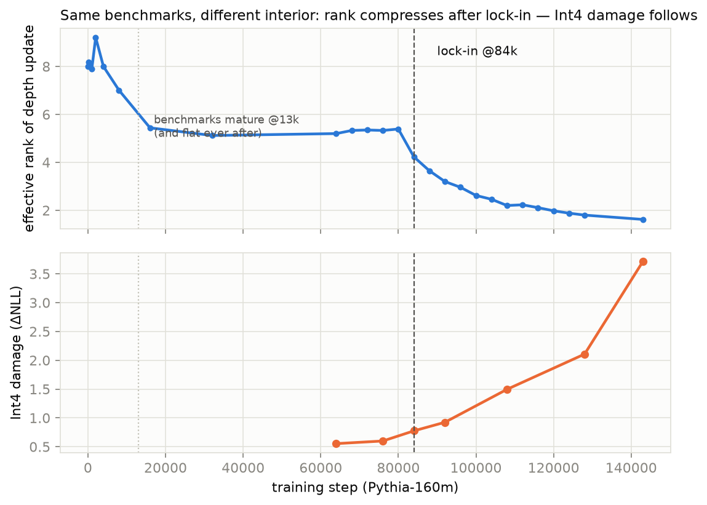
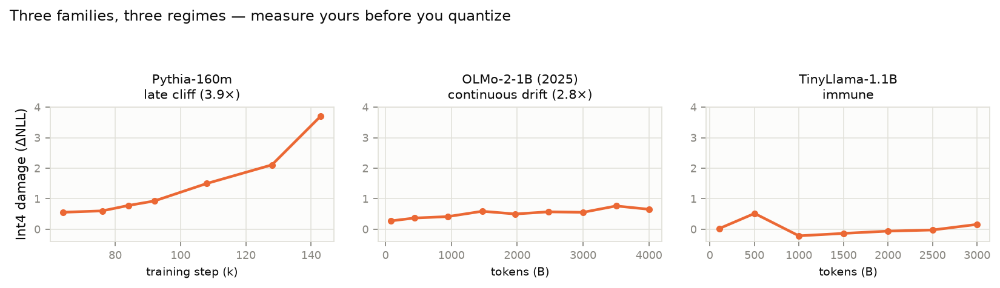

# quantcheck — pick the right checkpoint before you quantize

**TL;DR:** Late in LM pretraining, models keep the same benchmark scores but
become dramatically more fragile to 4-bit quantization. We link this to a
measurable internal correlate (depth-schedule rank compression after a
"lock-in" transition) and provide a cheap, label-free probe that tells you **which
checkpoint to quantize** — up to ~4× less Q4 damage at equal quality.





Longer read: [WRITEUP.md](WRITEUP.md) · interactive explainer:
[explainer/](explainer/) · full pre-registration ledger incl. negatives:
[PREREG.md](PREREG.md) · original lab notes (German): [docs/research_trail/](docs/research_trail/)

## The finding (Pythia suite)

| Pythia-160m checkpoint | PPL f16 | PPL Q4_K_M | ΔlnPPL (damage) |
|---|---|---|---|
| step 84 000 | 1.655 | 1.716 | **0.036** |
| step 143 000 (final) | 1.679 | 1.937 | **0.142 (3.9×)** |

- Damage onset coincides with an endogenous training event ("lock-in") that
  has no counterpart in the LR schedule and is invisible to loss/benchmarks.
- Candidate mechanism (correlate, not proven cause): post-lock-in **rank compression** of the mean depth
  update ("schedule"); Spearman(rank, Int4 damage) = −0.96 (160m) / −0.86 (410m).
- Replicated: **4 model scales (70m/160m/410m/1b)** × full quant spectrum —
  RTN 2–8 bit AND production GGUF Q2_K…Q8_0 (checkpoint-damage ratio
  2.4–10.5× across the menu, amplifying toward low bits: 13× at 2-bit RTN)
  × two probe languages (DE/EN). Rank↔damage chain: 70m (1.13 → **8.15**)
  · 160m (1.62 → 3.71) · 1b (7.02 → 0.55) · 410m (8.05 → 1.11). The 1b
  barely compresses at 300B tokens and barely suffers — **the effect hits
  small models hardest, exactly the ones quantized most aggressively.**
- **Second family (modern recipe): OLMo-2-1B, 2025.** 9 checkpoints over
  4T tokens: rank compresses continuously 9.7 → 3.7, Int4 damage rises
  0.27 → 0.76 peak (2.8×), rank↔damage ρ = −0.87. Milder than Pythia's
  cliff, same direction, same probe.

## What was actually run (exact matrix)

| Family | Scales | RTN Int4/Int8 | RTN 2-8 bit | real GGUF | probe |
|---|---|---|---|---|---|
| Pythia | 70m / 160m / 410m / 1b (checkpoints) | yes, all | 160m only | 160m (Q4_K_M + Q2_K...Q8_0) | DE + EN (160m) |
| OLMo-2-1B | 1 size, 9 ckpts / 4T tokens | Int4 | - | - | DE |
| TinyLlama-1.1B | 1 size, 7 ckpts / 3T tokens | Int4 | - | - | DE |
| OLMoE-1B-7B (MoE) | 1 size, 4/8 ckpts (suspended) | Int4 | - | - | DE |

Raw effective-rank values are only strictly comparable *within* a family
(the upper bound scales with depth); cross-scale statements are directional.
The "benchmarks stay flat" side of the claim reproduces via
`suites/benchmark_maturity.py` from EleutherAI's published per-checkpoint
evals (`results/pythia_benchmark_maturity.json`).

## Run it on YOUR suite — one command

```bash
pip install -r requirements.txt

# what checkpoint revisions exist?
python quantcheck.py --model allenai/OLMo-2-0425-1B --list-revisions

# measure 8 evenly spaced checkpoints, get a regime verdict + paste-ready report
python quantcheck.py --model <any-hf-model-with-checkpoint-revisions>     --auto-revisions 8 --issue-text
```

That's the whole ask: if you have GPU time and a checkpoint suite (or train
your own models), run this and [post the block as a replication
issue](../../issues/new?template=replication-report.md). The CLI resumes
after interruption, records your environment in the report, and labels the
regime (late-cliff / drift / flat) with declared v0 heuristics. Example
output: `results/example_quantcheck_report.json` — its numbers reproduce
the published Pythia values exactly (same code path).

## Usage

```bash
# 1. Rank curve over checkpoints (the telemetry)
python rank_probe.py --hf-model EleutherAI/pythia-160m --steps 64000:143000:8000

# 2. Quantization damage curve (RTN proxy, fast)
python quant_probe.py --hf-model EleutherAI/pythia-160m --probe en

# 3. Real GGUF check (optional; needs a llama.cpp build):
#    QUANTCHECK_LLAMACPP=/path/to/llama.cpp python gguf_probe.py
#    (see patches/ if conversion fails on transformers >= 5 configs)

# 4. Recommendation: earliest checkpoint after benchmark maturity,
#    before rank compression exceeds your damage budget.
```

Everything is self-contained: probe corpora live in `probes/` (DE: 31 texts, EN: 20), the frozen cross-family reference forms too. `pip install -r
requirements.txt`, then any script runs as-is; suite scripts write into
`results/`.

## Who this is for — and who it isn't for

Honest audience statement: the checkpoint-picking rule needs **checkpoint
suites** — it serves model trainers, finetuners, and suite publishers
(Pythia/OLMo-style). If you only have a final checkpoint, this repo tells
you *why* your Q4 might hurt and what to ask your model provider for, but
it cannot pick a better checkpoint for you. This repo is a **research artifact plus a one-command probe CLI**
(`quantcheck.py`) — the research scripts are published as-run.

## What this is / isn't

- ✅ A label-free, forward-pass-only probe (no benchmarks, no training).
- ✅ **Probe robustness quantified:** bootstrap over probe-text subsets
  (2000 resamples) gives disjoint 95% intervals for the headline
  checkpoints — 84k rank 4.23 [4.10, 4.42] vs 143k 1.62 [1.60, 1.64]
  (`results/rank_bootstrap.json`, `tools/rank_bootstrap.py`).
- ✅ Reproducible: all scripts, all numbers, all pre-registrations included.
- ✅ **Replicated on a modern 2025 recipe:** OLMo-2-1B (9 checkpoints,
  84B–4T tokens): all three pre-registered criteria hit (ρ tokens↔rank
  −0.88, tokens↔damage +0.87, rank↔damage −0.87; final/min damage 2.8×).
  Profile differs from Pythia — continuous compression instead of a late
  lock-in event — but the rank↔damage link holds.
- ✅ **Includes a pre-registered negative replication:** TinyLlama-1.1B
  (3T tokens, ~2,700 tok/param) shows NO compression and NO Int4 fragility.
  Three families, three regimes (late cliff / continuous drift / immune) —
  which is exactly why you should *measure* your suite instead of assuming.
- ❌ Not a claim about reasoning, capability, or model quality per se.
- ❌ Not a universal law: it's a measurable regime. Confirmed on Pythia
  (4 scales) + OLMo-2-1B, refuted on TinyLlama; **community replication on
  other suites (Amber, SmolLM, OLMo-7B…) is the explicit ask** — including
  finishing our suspended OLMoE MoE suite (4/8 checkpoints measured,
  `suites/olmoe_suite.py` is resumable and self-contained).

## Repo layout

```
quantcheck/
  rank_probe.py          # eff. rank of mean depth-update over checkpoints
  quant_probe.py         # fp32 vs RTN-Int4/Int8 ΔNLL per checkpoint (probe corpora included)
  gguf_probe.py          # real GGUF Q4_K_M via llama.cpp (optional)
  suites/                # full checkpoint-suite runs: olmo, tinyllama, olmoe (MoE),
                         # bit sweep, gguf spectrum, and the pre-registered
                         # (failed) post-hoc decompression experiment
  results/               # all JSONs incl. pre-registered criteria & verdicts
  explainer/             # interactive visual explainer (self-contained HTML)
  PREREG.md              # ledger: what was predicted before each run, incl. kills
  WRITEUP.md             # the long-form writeup (blog draft)
  figures/               # core result figures (generated from results/)
  docs/research_trail/   # original lab notes (German), as-run
  patches/               # small env fixes needed for reproduction
  CITATION.cff           # how to cite
  requirements.txt
```

Note: code comments are partly in German — these are the actual research
scripts, published as-run. Cleanup PRs welcome; numbers won't change.

## AI contribution & validation status

Research direction, decisions, verdicts and publication: Jan R.
Implementation, experiment execution and analysis: heavily AI-assisted
(Claude; visible as co-author in the commit history). The results have not
yet been independently peer-validated - replication and critique are the
explicit purpose of this release. Command-per-result guide: [REPRODUCE.md](REPRODUCE.md).

## Provenance & method

Built with a falsification-first workflow (pre-registered endpoints,
kill criteria, negative results published). Full research trail:
lamendo research — "Representation Observatory" series. License: Apache-2.0.
